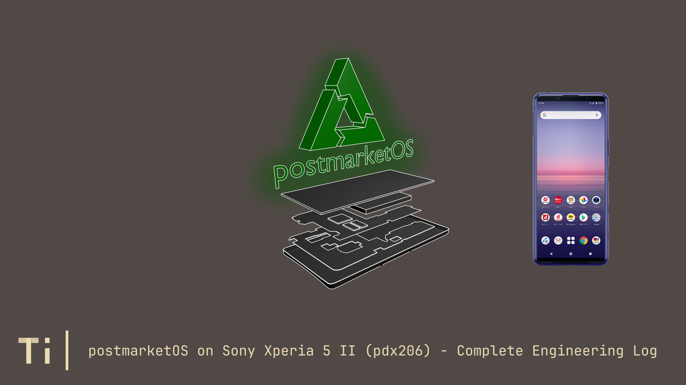
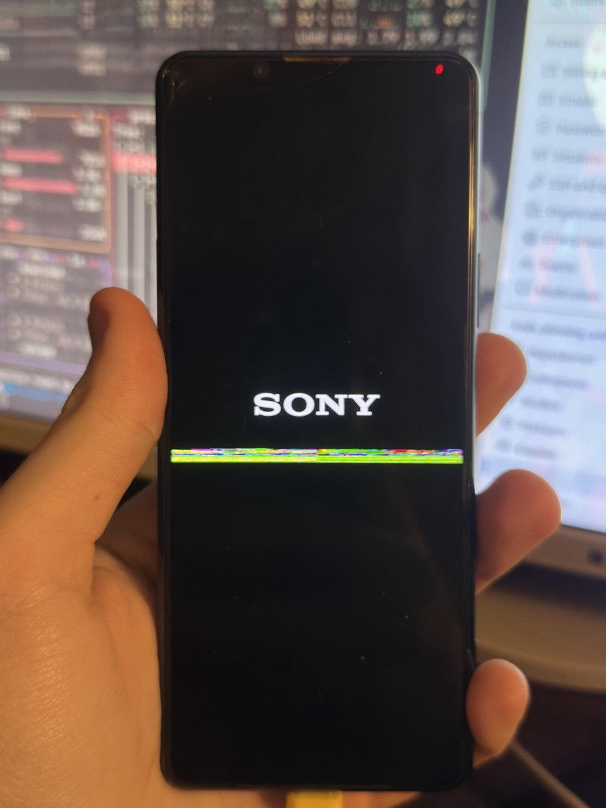

<h1 align="center">postmarketOS on Sony Xperia 5 II (pdx206) - Complete Engineering Log</h1>

<h4 align="center">Also available in human-readable and downloadable .PDF version!</h4>

<p align="center">
  <a href="https://github.com/terminal-index/pdx206-mainline/blob/main/pdx206-mainline-readme.pdf">Download from repository</a>
</p>



> *"Finally, after two years of thinking how to do it, I somehow started doing it and it's going pretty fine. I'm never stopping."*
---

## Introduction

This document chronicles my engineering journey to run mainline Linux Kernel on the Sony Xperia 5 II (codenamed pdx206), a Snapdragon 865-based flagship from 2020. What started as a "just flash postmarketOS and see what happens" experiment turned into weeks of reverse engineering, device tree surgery, and countless reboots.

Why this device? Because that's the only working Android device I own in my room. 

Just kidding, Xperia 5 II has excellent hardware (120Hz OLED, Adreno 650, SD865), an unlockable bootloader, and Sony's relatively open approach to kernel sources. It deserved better than being locked to an outdated Android version - final Sony update stayed on Android 12L.

What works today:

- Mainline Linux 6.17 boots with functional display (simpledrm)
- USB networking (RNDIS), SSH access, full rootfs on microSD
- Basic peripherals (WiFi pending firmware, Bluetooth untested)

What doesn't (yet):

- Hardware GPU acceleration (Freedreno blocked by firmware loading issues)
- Audio (CS35L41 amplifiers need MI2S DAI links in device tree)
- Camera, sensors, cellular modem
- Phone itself (I consider phone functional when all functions work)

This is not a polished guide - it's a raw engineering log documenting every dead end, breakthrough, and late-night debugging session. If you're attempting something similar on SM8250 or other Qualcomm devices, I hope this saves you time.

>(State from 27-02-2026) - Wasted hours whilst researching and building anything for this phone: **163**

<table>
  <tr>
    <td></td>
    <td></td>
    <td></td>
    <td></td>
  </tr>
</table>

---

## Table of Contents

1. [Device & Environment Overview](#1-device--environment-overview)
2. [Glossary of Technical Terms](#2-glossary-of-technical-terms)
3. [Project Goals](#3-project-goals)
4. [Phase 0 - The Old Approach](#4-phase-0---the-old-approach-abandoned-threw-away-the-idea)
5. [Phase 1 - Switching to pmbootstrap + Mainline Kernel](#5-phase-1---switching-to-pmbootstrap--mainline-kernel)
6. [Phase 2 - The XBoot "Corrupt Device" Problem & Hybrid DTB](#6-phase-2---the-xboot-corrupt-device-problem--hybrid-dtb)
7. [Phase 3 - Custom Boot Image Repacking](#7-phase-3---custom-boot-image-repacking-repack_mainline_fixedsh)
8. [Phase 4 - Debugging Boot Failures](#8-phase-4---debugging-boot-failures-regulator--watchdog)
9. [Phase 5 - The Custom Initramfs](#9-phase-5---the-custom-initramfs)
10. [Phase 6 - USB RNDIS Networking & SSH Access](#10-phase-6---usb-rndis-networking--ssh-access)
11. [Phase 7 - microSD Card Boot (MMC Driver)](#11-phase-7---microsd-card-boot-mmc-driver)
12. [Phase 8 - Full postmarketOS Boot via switch_root](#12-phase-8---full-postmarketos-boot-via-switch_root)
13. [Phase 9 - GPU Acceleration Investigation](#13-phase-9---gpu-acceleration-investigation)
14. [Phase 10 - DTB Surgery: Enabling GPU, GMU, DSI](#14-phase-10---dtb-surgery-enabling-gpu-gmu-dsi)
15. [Phase 11 - The Missing Panel Driver & The Real Root Cause](#15-phase-11---the-missing-panel-driver--the-real-root-cause)
16. [Phase 12 - The "Trojan Horse" Panel Fix](#16-phase-12---the-trojan-horse-panel-fix)
17. [Phase 13 - GPU zap-shader Removal Fix](#17-phase-13---gpu-zap-shader-removal-fix)
18. [Phase 14 - Droidian 4.19 Kernel Hybrid Experiment](#18-phase-14---droidian-419-kernel-hybrid-experiment)
19. [Phase 15 - KGSL vs Freedreno: The GPU Driver Problem](#19-phase-15---kgsl-vs-freedreno-the-gpu-driver-problem)
20. [Phase 16 - HAL Blobs Investigation](#20-phase-16---hal-blobs-investigation)
21. [Phase 17 - Weston/Wayland Compositor Failures](#21-phase-17---westonwayland-compositor-failures)
22. [Working Components Status](#22-working-components-status)
23. [Known Remaining Issues](#23-known-remaining-issues)
24. [Key Files Reference](#24-key-files-reference)
25. [Quick-Start Commands](#25-quick-start-commands)
26. [Future Solutions Roadmap](#26-future-solutions-roadmap)
27. [Contributing & Getting Help](#27-contributing--getting-help)

---

## 1. Device & Environment Overview

| Property           | Value                                                        |
|--------------------|--------------------------------------------------------------|
| **Tested Model**          | Sony Xperia 5 II                                             |
| **Codename**       | pdx206 (edo family)                                          |
| **SoC**            | Qualcomm Snapdragon 865 (SM8250, "Kona")                     |
| **CPU**            | 8-core Kryo 585: 1× Cortex-X1 @ 2.84GHz, 3× A77 @ 2.42GHz, 4× A55 @ 1.80GHz |
| **GPU**            | Adreno 650                                                   |
| **RAM**            | 8 GB LPDDR5                                                  |
| **Storage**        | 128 GB UFS 3.0 (internal), microSD (rootfs)                  |
| **Display**        | 6.1" OLED 2520×1080, 120Hz, Samsung AMB609TC01 (SOFEF03-M DDIC) |
| **Architecture**   | aarch64                                                      |
| **Bootloader**     | XBoot (Sony proprietary, version `1320-2827_X_Boot_SM8250_LA2.0.1_S_204`) |
| **Boot Mode**      | Fastboot (unlockable via Sony Developer Program)                                        |
| **Target OS**      | postmarketOS (Alpine-based, mainline Linux)                  |
| **Kernel**         | `linux-postmarketos-qcom-sm8250` 6.17.0 (SoMainline based)  |
| **Rootfs Storage** | Samsung EVO microSD card `/dev/mmcblk0p2` (formatted as ext4), 64 GB                 |
| **Host PC**        | Arch Linux x86\_64 |
| **pdx206's IP**       | Open at `172.16.42.1` (USB RNDIS)                                    |
| **Host PC IP**     | Open at `172.16.42.2` (USB RNDIS)                                    |

---

## 2. Glossary of Technical Terms

> Beware! Difficult words ahead.

| The Thing | The Explanation |
|------|-------------|
| **Mainline Kernel** | The official upstream Linux kernel, maintained at kernel.org. Does not contain vendor-specific hacks. Switched from building it manually to modifying the Mainline kernel. |
| **Downstream Kernel** | Sony's Android kernel fork - insanely patched, containing proprietary drivers, but incompatible with mainline Linux userland. It wasn't ever it's purpose, so why should it be compatible, right? |
| **pmbootstrap** | postmarketOS's build system. Manages Alpine Linux chroots, cross-compiles the kernel, generates rootfs images, and installs to SD/eMMC/any drive type that mounts under Linux. |
| **XBoot** | Sony's proprietary first-stage bootloader. Loads the boot image from flash, validates DTB pool contents against board IDs before jumping to the kernel. |
| **DTB / DTS** | Device Tree Blob / Source. A data structure describing physical hardware layout (memory addresses, interrupt lines, GPIO mappings, I2C/SPI devices) passed from the XBoot to the kernel. |
| **Hybrid DTB Pool** | A concatenation of the Android downstream DTB (for Sony XBoot validation) and the Mainline DTB (for the Linux kernel). XBoot finds and validates the first; the Mainline kernel finds and uses the second. |
| **initramfs** | A gzip'd cpio archive embedded in the boot image. The kernel extracts it into tmpfs and runs `/init` before any real filesystem is mounted. |
| **RNDIS** | Remote NDIS - Microsoft's protocol for USB Ethernet emulation. Lets the phone appear as a network adapter to the host PC. Only method for enabling internet on this device without right Wi-Fi drivers. |
| **Fastboot** | Google's low-level flashing protocol. Used to write `.img` files to specific flash partitions (`boot_a`, `boot_b`, `dtbo_a`, etc.) |
| **ramoops** | A kernel driver that writes crash/panic logs to a dedicated reserved memory region that survives reboots. Retrieved from `/sys/fs/pstore/`. I hate you ramoops. You made my year miserable, and it began almost 3 months ago. |
| **msm\_drm** | Qualcomm's DRM (Direct Rendering Manager) kernel driver. On SM8250, it handles the entire display pipeline (DPU -> DSI -> Panel) and the GPU (Adreno/freedreno). |
| **DRM Bridge** | A Linux kernel abstraction for chained display components. Each link in the chain (DSI controller -> DSI PHY -> Panel) registers as a bridge. All must be present or the chain fails to initialize. |
| **aux\_bridge** | A placeholder bridge created by `msm_drm` when a DSI port endpoint exists in the Device Tree but points to nothing. Its failure (`-ENODEV`) means no panel was found. |
| **freedreno** | The open-source Adreno GPU driver stack (kernel's `msm_drm` + Mesa `freedreno`). Provides OpenGL ES and Vulkan (Turnip) acceleration. |
| **KGSL** | Qualcomm's proprietary GPU driver used in downstream Android kernels. Uses `/dev/kgsl-3d0` instead of standard DRM. Sadly, incompatible with Mesa. That would make my work easier. |
| **llvmpipe** | CPU-based software OpenGL renderer. Known widely as "Software Rendering" and used as fallback when no GPU driver is available. |
| **qcom\_scm** | Qualcomm Secure Channel Manager. Interface to Qualcomm's TrustZone. Required for authenticating/loading GPU firmware (ex. `a650_zap.mbn`). |
| **GMU** | GPU Management Unit. Handles Adreno 6xx power and clock management. |
| **SOFEF00/SOFEF03** | Samsung OLED display DDICs used in various phones. SOFEF00 in OnePlus 6T; SOFEF03-M in Sony Xperia 5 II. Same protocol family. It was quite a challenge to find any information about it on the internet, not gonna lie. |
| **phandle** | A numeric handle in the Device Tree used to cross-reference nodes. Corrupting phandles breaks driver initialization. |
| **fdtput** | A tool for surgically modifying individual properties inside a DTB binary without decompiling/recompiling (which risks corrupting phandles). |
| **mkbootimg** | Google's tool for assembling Android boot images from kernel + ramdisk + DTB with specific header offsets. |
| **libhybris** | Compatibility layer allowing Linux programs to use Android HAL libraries. Required to use KGSL blobs on non-Android systems. |
| **zap-shader** | Qualcomm's signed GPU initialization shader (`a650_zap.mbn`). Requires TrustZone authentication which I cannot crack yet. |

---

## 3. Project Goals

1. Boot Mainline Linux Kernel (not Sony's downstream Android kernel - in this case LineageOS Kernel - branch lineage-23.2) on a Sony Xperia 5 II.
2. Trick Sony's locked-down XBoot into loading a Mainline-kernel boot image.
3. Use `pmbootstrap` to build the entire rootfs, kernel, and initramfs system.
4. Boot into a full, working postmarketOS environment (systemd, Phosh/GNOME shell).
5. Enable hardware GPU acceleration (Adreno 650 / freedreno) to make the UI usable.

---

## 4. Phase 0 - The Old Approach (Abandoned, threw away the idea)

What have I tried: Manual cross-compilation of Sony's downstream Android kernel (`android_kernel_sony_sm8250`), bundled with a custom handwritten `init` script and `cpio` initramfs.

Why have I abandoned this idea:
- The downstream kernel requires `CONFIG_USER_NS=n`, which basically breaks `systemd` entirely.
- The downstream kernel uses thousands of proprietary Qualcomm driver patches that don't exist in the mainline tree.
- Maintaining the downstream kernel is a dead end for a proper Linux port.

My decision: Completely switch to `linux-postmarketos-qcom-sm8250` (mainline kernel) and `pmbootstrap`.

The Android kernel source tree (`android_kernel_sony_sm8250/`) was kept for reference only, specifically to look up DSI panel initialization command sequences.

---

## 5. Phase 1 - Switching to pmbootstrap + Mainline Kernel

### 5.1 Setting up postmarketOS' pmbootstrap

```bash
# Installing the pmbootstrap in Docker (with ubuntu:latest image) container (to completely 
# avoid compatibility issues) since Arch Linux does not support pip properly.
pip install --user pmbootstrap

# Initialize (select device: sony-pdx206, kernel: linux-postmarketos-qcom-sm8250)
pmbootstrap init

# Install postmarketOS to microSD card
pmbootstrap install --sdcard=/dev/mmcblk0
```

This created a full Alpine-based rootfs postmarketOS installation on the SD card with:

- Partition 1: FAT32 boot partition (`/dev/mmcblk0p1`), ~256MB  
- Partition 2: ext4 rootfs (`/dev/mmcblk0p2`), ~63GB

A helper script was created to automate the full install, handling `udisks2` conflicts (because my Arch Linux decided to automount every partition):

```bash
# run_pmos_install.sh
sudo systemctl stop udisks2.service
sudo systemctl mask udisks2.service
sudo -E pmbootstrap install --sdcard=/dev/mmcblk0
sudo systemctl unmask udisks2.service
sudo systemctl start udisks2.service
./repack_mainline_fixed.sh
# .sh scripts made my job faster
```

### 5.2 Key Kernel Configuration changes made over the project

The kernel config is defaultly at:
```
~/.local/var/pmbootstrap/cache_git/pmaports/device/community/linux-postmarketos-qcom-sm8250/config-postmarketos-qcom-sm8250.aarch64
```

Changes applied over the project:

| Config option | Change | Reason |
|---|---|---|
| `CONFIG_MMC` | `not set` -> `=y` | microSD card not detected (SDHCI driver missing) |
| `CONFIG_MMC_BLOCK` | `not set` -> `=y` | microSD block device not created |
| `CONFIG_MMC_SDHCI` | `not set` -> `=y` | SD controller base driver |
| `CONFIG_MMC_SDHCI_PLTFM` | `not set` -> `=y` | Platform SDHCI |
| `CONFIG_MMC_SDHCI_MSM` | `not set` -> `=y` | Qualcomm MSM SDHCI |
| `CONFIG_MMC_CQHCI` | `not set` -> `=y` | Command Queue Host Controller |
| `CONFIG_DRM_PANEL_SAMSUNG_SOFEF00` | `not set` -> `=y` | Fake panel driver for GPU pipeline (testing it) |

After each config change, the kernel had to be rebuilt and the checksum updated:
```bash
# Update checksum after modifying config
pmbootstrap checksum linux-postmarket-qcom-sm8250

# Rebuild kernel
pmbootstrap build linux-postmarketos-qcom-sm8250 --force
```

---

## 6. Phase 2 - The XBoot "Corrupt Device" Problem & Hybrid DTB

### 6.1 The Problem

When we first attempted to flash a boot image built with the Mainline kernel + Mainline DTB, the phone displayed:

``` 
[GARGANTUIC WARNING SIGN!]
Your device is corrupt.
It can't be trusted and will not boot.
```

Sony's XBoot performs a strict validation of the DTB pool inside the boot image. It occurs because of enabled secure boot in XBoot. It scans for Board ID signatures and proprietary markers that are present in Sony's Android DTBs but absent from the upstream Mainline DTB (`sm8250-sony-xperia-edo-pdx206.dtb`).

### 6.2 The Hybrid DTB Breakthrough

The key insight: XBoot scans the DTB pool sequentially. If the first DTB in the pool validates correctly, XBoot allows booting. The Mainline kernel, when it boots, also scans the DTB pool - but it picks the DTB that matches its own expected compatible string.

**My solution:** Mix both DTBs into a single pool binary:

```bash
# The Android DTB (passes XBoot validation)
kona.dtb         # extracted from stock Sony firmware via ADB

# The Mainline DTB (used by the mainline kernel)
sm8250-sony-xperia-edo-pdx206.dtb

# Combine them
cat kona.dtb sm8250-sony-xperia-edo-pdx206.dtb > hybrid_exact.img
# Crazy, right?
```

XBoot finds `kona.dtb` first -> validates -> boots.  
Mainline kernel finds `sm8250-sony-xperia-edo-pdx206.dtb` (matching `"sony,pdx206"`) -> initializes from it.

The final file used as the DTB in `mkbootimg` calls is `hybrid_exact.img`.

> **Note:** This is now replaced by our GPU-patched DTB, which still contains the hybrid pool structure.

---

## 7. Phase 3 - Custom Boot Image Repacking (`repack_mainline_fixed.sh`)

Sony's XBoot requires very specific boot image header values. We cannot simply use `pmbootstrap flasher boot` - it generates an image with wrong offsets.

The `repack_mainline_fixed.sh` script does everything:

1. Builds the custom initramfs from `initramfs_root/` using `cpio + gzip`
2. Calls `mkbootimg` with exact Kona-platform offsets
3. Flashes both slots (`boot_a`, `boot_b`) via fastboot
4. Sets active slot to `a` and reboots

```bash
#!/bin/bash
set -ex
# Step by step
# 1. Build custom initramfs
cd /home/szoltysek/docker-linux/pdx206/initramfs_root
find . -print0 | cpio --null -ov --format=newc | gzip -9 > ../initramfs.cpio.gz
cd ..

# Path defining
BOOT_DIR="~/.local/var/pmbootstrap/chroot_rootfs_sony-pdx206/boot"
KERNEL="$BOOT_DIR/vmlinuz"
DTB_PDX206="/tmp/pdx206-gpu-dsi-panel.dtb"  # <- evolves with time!
OUTPUT="mainline_fixed.img"

# 2. Pack out boot image
mkbootimg --kernel "$KERNEL" \
          --ramdisk "initramfs.cpio.gz" \
          --dtb "$DTB_PDX206" \
          --base 0x0 \
          --kernel_offset 0x8000 \
          --ramdisk_offset 0x01000000 \
          --tags_offset 0x100 \
          --dtb_offset 0x01f00000 \
          --pagesize 4096 \
          --header_version 2 \
          --cmdline "console=ttyMSM0,115200n8 console=tty0 earlycon=msm_geni_serial,0xa90000 \
                     root=/dev/mmcblk0p2 rw rootwait loglevel=7 ignore_loglevel" \
          --output "$OUTPUT"

# 3. Flash
fastboot flash boot_a "$OUTPUT"
fastboot flash boot_b "$OUTPUT"
fastboot set_active a
fastboot reboot
```

**Key mkbootimg offsets for sm8250 / Kona:**

- `--base 0x0`
- `--kernel_offset 0x8000`
- `--ramdisk_offset 0x01000000`
- `--dtb_offset 0x01f00000`
- `--pagesize 4096`
- `--header_version 2`

---

## 8. Phase 4 - Debugging Boot Failures (Regulator + watchdog)

### 8.1 Symptoms

The phone would boot, briefly show activity on serial (`ttyMSM0`), then reboot after around 30 seconds with no panic. `dmesg` logs obtained via `ramoops` (pulled via ADB shell from `/sys/fs/pstore/console-ramoops-0` after reflash) showed:

```dmesg
[31.712116] pm8009_l6: disabling
[31.712226] display_panel_avdd: disabling
[31.712600] i2c_geni 994000.i2c: i2c error :-107
```

### 8.2 Root Cause 1 - `regulator_late_cleanup()`

Linux's power management performs a late regulator cleanup pass after all drivers finish probing. Any power rail (voltage regulator) not exclusively claimed by a driver is powered off to save energy.

On a minimal initramfs with no panel driver, audio driver, or camera driver, the following critical rails were being shut off:

- `display_panel_avdd` - display OLED panel power
- `pm8009_l6` - sub-PMIC regulator powering I2C bus controllers

Powering off the I2C controller mid-boot causes one of two cascades:
- Error `-107` (`ENOTCONN`) on the I2C bus
- System hang or reset

**Fix:** Add kernel command-line parameters to suppress the cleanup:
```
regulator_ignore_unused  
pd_ignore_unused  
clk_ignore_unused
```

These were added permanently to the `--cmdline` argument in `repack_mainline_fixed.sh`.

### 8.3 Root Cause 2 - Hardware Watchdog

The Qualcomm PMIC hardware watchdog is started by XBoot before handing off to the kernel, with a ~32-second timeout. If nothing writes to the watchdog device within that time, the PMIC triggers a hardware board reset (not a kernel panic - no ramoops written!).

When we were manually interfering with the `msm_watchdog` driver (trying to prevent it from loading), the timer expired.

**Fix:** Let `msm_watchdog` load normally. It takes over petting the hardware watchdog automatically. Our `init` script also runs `busybox watchdog -t 5 /dev/watchdog` as an early fallback.

```bash
# From initramfs_root/init:
if [ -c /dev/watchdog ]; then
    watchdog -t 5 /dev/watchdog &
elif [ -c /dev/watchdog0 ]; then
    watchdog -t 5 /dev/watchdog0 &
fi
```

---

## 9. Phase 5 - The Custom Initramfs

Because `pmbootstrap`'s generated initramfs works differently from what we need (we boot from SD card, not UFS), we maintain our own initramfs in `initramfs_root/`.

### 9.1 Structure

```
initramfs_root/
├── bin/
│   ├── busybox      # statically linked busybox for all shell utils
│   ├── sh -> busybox
│   └── netshell     # our custom TCP shell (see # Phase 6)
├── etc/
├── dev/
├── proc/
├── sys/
├── mnt/root/        # microSD Card rootfs is mounted here
├── sbin/
├── usr/bin/
├── usr/sbin/
└── init             # our main boot script
```

### 9.2 What `init` does (in order)

1. Install busybox symlinks (`busybox --install -s /bin`)
2. Write banner to `/dev/kmsg` (appears in dmesg)
3. Mount `/proc`, `/sys`, `/dev`, `/dev/pts`
4. Set kernel loglevel to 7 (every log is shown)
5. Unblank display (`echo 0 > /sys/class/graphics/fb0/blank`)
6. Set up USB RNDIS gadget via ConfigFS:
   - Creates gadget `g1` with VID `0x18d1` / PID `0x4ee2`
   - Sets manufacturer: "Sony", product: "Xperia 5 II"
   - Creates RNDIS function and links to config
   - Waits for UDC (USB Device Controller) to appear (up to 15s)
   - Binds UDC
   - Assigns `172.16.42.1/24` to `rndis0` or `usb0`
7. Start busybox watchdog (feeds hardware watchdog, 5 second interval)
8. Wait for microSD card detection (`/dev/mmcblk0p2`) up to 30 seconds
9. Mount microSD card ext4 rootfs at `/mnt/root`
10. Inject services into the mounted rootfs:
    - Copies `netshell` binary to `/mnt/root/usr/bin/`
    - Creates `rndis-network.service` (systemd service to re-setup RNDIS IP in userspace)
    - Creates `netshell.service` (yet permanent TCP shell loop on port 23)
    - Symlinks both into `multi-user.target.wants/`
    - Patches `systemd`'s `RuntimeWatchdogSec=5s`
11. Move virtual filesystems to new root (`mount --move`)
12. Stop busybox watchdog gracefully (kills it before pivot)
13. `switch_root` to `/mnt/root`, exec `systemd` as PID 1
14. If `switch_root` fails -> rescue mode: starts `netshell` on port 23 and loops with heartbeat messages

---

## 10. Phase 6 - USB RNDIS Networking & SSH Access

### 10.1 pdx206 Side

The initramfs sets up RNDIS with IP `172.16.42.1`. After `switch_root`, the injected `rndis-network.service` re-establishes the IP under systemd.

SSH is available once postmarketOS boots (OpenSSH server is installed default by pmbootstrap).

Default SSH user: `szoltysek` (set during `pmbootstrap init`).

### 10.2 My PC with Arch Linux Side

The `auto_ip.sh` script runs persistently on the host PC to detect and configure the RNDIS interface whenever the phone connects:

```bash
while true; do
    if ip link show enp0s20f0u1 > /dev/null 2>&1; then
        if ! ip addr show enp0s20f0u1 2>/dev/null | grep -q "172.16.42.2"; then
            sudo ip link set enp0s20f0u1 up
            sudo ip addr add 172.16.42.2/24 dev enp0s20f0u1
        fi
    fi
    sleep 0.5
done
```

The RNDIS interface on the host is `enp0s20f0u1`.

### 10.3 Internet Passthrough to Phone

For installing packages on the phone:
```bash
# enable_internet_passthrough.sh
sudo sysctl net.ipv4.ip_forward=1
HOST_IFACE=$(ip route show default | awk '/default/ {print $5}')
sudo iptables -t nat -A POSTROUTING -o $HOST_IFACE -j MASQUERADE
sudo iptables -A FORWARD -m conntrack --ctstate RELATED,ESTABLISHED -j ACCEPT
sudo iptables -A FORWARD -i enp0s20f0u1 -o $HOST_IFACE -j ACCEPT
```

On pdx206:
```bash
sudo ip route add default via 172.16.42.2
echo 'nameserver 8.8.8.8' | sudo tee /etc/resolv.conf
```

### 10.4 SSH command

```bash
ssh szoltysek@172.16.42.1
```

---

## 11. Phase 7 - microSD Card Boot (MMC Driver)

### 11.1 Problem

After switching to the Mainline kernel, the SD card was not detected at all. The device `/dev/mmcblk0` never appeared. The initramfs waited its full 30s then dropped to rescue mode.

### 11.2 Root Cause

The `linux-postmarketos-qcom-sm8250` kernel config had `# CONFIG_MMC is not set` - the entire MMC/SDHCI subsystem was compiled out.

### 11.3 Fix

```bash
sed -i 's/# CONFIG_MMC is not set/CONFIG_MMC=y\nCONFIG_MMC_BLOCK=y\nCONFIG_MMC_SDHCI=y\nCONFIG_MMC_SDHCI_PLTFM=y\nCONFIG_MMC_SDHCI_MSM=y\nCONFIG_MMC_CQHCI=y/' \
    config-postmarketos-qcom-sm8250.aarch64

pmbootstrap build linux-postmarketos-qcom-sm8250 --force
```

After rebuild, the microSD card appeared within ~4 seconds of boot:
```dmesg
[    4.029963] mmc0: SDHCI controller on 8804000.mmc [8804000.mmc] using ADMA 64-bit
[    4.327252] mmc0: new UHS-I speed SDR104 SDXC card at address 59b4
[    4.354669] mmcblk0: mmc0:59b4 EC1S5 59.7 GiB
[    4.362714] mmcblk0: p1 p2
```

---

## 12. Phase 8 - Full postmarketOS Boot via switch_root

With the microSD card working and the custom initramfs, the full boot sequence is:

```
XBoot -> [validates kona.dtb in hybrid pool] -> loads boot image
  -> Linux kernel unpacks initramfs
     -> /init runs → USB RNDIS up → watchdog fed
     -> SD card detected (mmcblk0p2) → ext4 mount
     -> systemd services injected into rootfs
     -> switch_root → systemd PID 1
        -> postmarketOS boots → GNOME Shell / Phosh
```

Confirmed from `dmesg_2.log` timestamps:

- `[4.080]` - `/init` starts
- `[5.171]` - USB RNDIS gadget bound
- `[6.252]` - RNDIS IP assigned
- `[6.507]` - microSD card ext4 mounted
- `[8.735]` - systemd starts
- `[12.025]` - Touch-screen driver (`s6sy761`) probe succeeds
- `[22.77]` - GPU clock sync pending (GPU not yet initialized)

---

## 13. Phase 9 - GPU Acceleration Investigation

### 13.1 Symptoms

Despite the full OS booting, the GNOME Shell was running sometimes at 60 FPS, sometimes at 1 or 2 FPS. `dmesg` showed:

```dmesg
[    4.045733] aux_bridge.aux_bridge aux_bridge.aux_bridge.0: error -ENODEV: failed to acquire drm_bridge
[   10.201182] systemd[1]: Load Kernel Module drm skipped, unmet condition check ConditionKernelModuleLoaded=!drm
[   22.770365] gcc-sm8250 100000.clock-controller: sync_state() pending due to 3d6a000.gmu
[   22.778798] sm8250-gpucc 3d90000.clock-controller: sync_state() pending due to 3d6a000.gmu
```

Apparently, the GPU (`3d00000.gpu`) and GMU (`3d6a000.gmu`) were added to IOMMU correctly, but `msm_drm` never probed. The system fell back to `simpledrm` (bootloader framebuffer, no GPU = bad).

### 13.2 The `msm_drm` Architecture Problem

On Qualcomm SM8250, `msm_drm` is a monolithic driver that handles:

- DPU (Display Processing Unit)
- DSI controller
- DSI PHY
- Panel
- Adreno GPU (freedreno)

All components must chain together. The Linux DRM bridge chain must be:
```
DPU -> DSI Controller -> DSI PHY -> [pdx206 Panel]
```

If any link is missing or returns `ENODEV`, the whole `msm_drm` driver refuses to probe, and the GPU is never registered - even though it's physically present on the SoC.

### 13.3 The qcom_scm Error

A secondary error also appeared:
```dmesg
[   12.045534] qcom_scm firmware:scm: Assign memory protection call failed -22
```

This is TrustZone refusing the kernel's request to allocate protected memory for the GPU's zap shader firmware (`a650_zap.mbn`). Error `-22` is `EINVAL`.

This is a separate blocker - even if `msm_drm` loads, the GPU won't fully initialize without TZ authentication of the firmware. This is a known upstream issue with memory protection configuration on SM8250.

---

## 14. Phase 10 - DTB Surgery: Enabling GPU, GMU, DSI

### 14.1 Approach: `fdtput` (Surgical Binary Patching)

We cannot use the naïve approach of:
```bash
dtc -I dtb -O dts > file.dts  # decompile
# Edit file.dts
dtc -I dts -O dtb < file.dts  # recompile
```

Recompiling a decompiled DTS corrupts the phandle numbering. Phandles are cross-references between DT nodes (e.g., a clock consumer pointing to a clock provider). Corruption breaks the touchscreen, power domains, clocks - everything.

My solution: Use `fdtput` to surgically modify only specific properties in the binary DTB without touching anything else:

```bash
cp $ORIG_DTB /tmp/pdx206-safe-patch.dtb

fdtput -t s /tmp/pdx206-safe-patch.dtb /soc@0/gpu@3d00000         status "okay"
fdtput -t s /tmp/pdx206-safe-patch.dtb /soc@0/gmu@3d6a000         status "okay"
fdtput -t s /tmp/pdx206-safe-patch.dtb \
    /soc@0/display-subsystem@ae00000/dsi@ae94000                    status "okay"
fdtput -t s /tmp/pdx206-safe-patch.dtb \
    /soc@0/display-subsystem@ae00000/phy@ae94400                    status "okay"
```

The resulting DTB was saved as `sm8250-sony-xperia-edo-pdx206-gpu.dtb` and used in `repack_mainline_fixed.sh`.

### 14.2 What the `patch_dtb.sh` Script Also Tries

A separate `patch_dtb.sh` script (using `sed` on a decompiled `.dts`) was also developed for diagnostic purposes. However, due to the phandle-corruption risk, it was not used for production DTBs.

---

## 15. Phase 11 - The Missing Panel Driver & The Real Root Cause

### 15.1 What `aux_bridge` Error Actually Means

After enabling DSI in the DTB and rebooting, the `aux_bridge` error persisted. Investigation of the DTS showed why:

```dts
// From sm8250-sony-xperia-edo-pdx206.dtb (upstream mainline)
dsi@ae94000 {
    status = "okay";   // we enabled this...
    ...
    ports {
        port@0 {
            endpoint { remote-endpoint = <&dpu_intf1_out>; };
        };
        port@1 {
            reg = <0x01>;
            endpoint {
                // it's empty sooo no remote-endpoint, no panel!
            };
        };
    };
};
```

`port@1` of the DSI controller is where the display panel should be connected. The upstream Mainline kernel DTS intentionally leaves this empty because no panel driver exists yet for the pdx206's Samsung AMB609TC01 display.

When `msm_drm` sees an empty `port@1`, it creates an `aux_bridge` placeholder and tries to find a DRM bridge for it. Since there is none, it returns `-ENODEV`.

*This is why the GPU does not work.* There is no upstream panel driver for this display. No panel -> no DRM bridge chain -> no `msm_drm` probe -> no GPU.

### 15.2 The Panel: Samsung AMB609TC01 / SOFEF03-M

Sony Xperia 5 II uses:

- Panel manufacturer: Samsung Display
- Panel model: AMB609TC01
- Display driver IC (DDIC): SOFEF03-M
- Interface: MIPI DSI, 4-lane, command mode
- Resolution: 2520×1080 @ 120Hz

> **Note:** The `SOFEF03-M` is part of Samsung's `SOFEF0x` family (same as `SOFEF00` used in the OnePlus 6T). The DDIC communicates using proprietary Samsung MIPI commands for initialization.

### 15.3 Existing Panel Drivers Checked (All in kernel config)

All panel drivers were surveyed:

| Driver | `CONFIG_` | Suitable? |
|--------|-----------|-----------|
| `samsung,sofef00` | `CONFIG_DRM_PANEL_SAMSUNG_SOFEF00` | Closest match |
| `samsung,sofef00-ams628nw01` | Same | OnePlus 6T variant |
| `panel-dsi-cm` | `CONFIG_DRM_PANEL_DSI_CM` | Generic, but only for `tpo,taal`, `nokia,himalaya`, `motorola,droid4-panel` |
| `samsung,s6e3ha8` | `CONFIG_DRM_PANEL_SAMSUNG_S6E3HA8` | Wrong resolution and/or protocol |

---

## 16. Phase 12 - The "Trojan Horse" Panel Fix

### 16.1 Strategy

Since XBoot already initializes the display panel before the Linux kernel boots (using its own Sony-proprietary initialization code), the display works in `simple-framebuffer` mode. Linux kernel does not need to re-initialize the panel from scratch.

What we do need is for the kernel's `msm_drm` driver to see a valid panel device at `dsi@ae94000/port@1` so it completes its DRM bridge chain and registers the GPU.

Approach: Create a fake panel node in the DTB that uses `compatible = "samsung,sofef00"`. This will load the closest available driver. Since the display is already on, the driver's init sequence (even if slightly wrong) will just be ignored or re-applied harmlessly on an OLED that can absorb extra commands.

### 16.2 Step 1: Enable Driver in Kernel Config

```bash
sed -i 's/# CONFIG_DRM_PANEL_SAMSUNG_SOFEF00 is not set/CONFIG_DRM_PANEL_SAMSUNG_SOFEF00=y/' \
    config-postmarketos-qcom-sm8250.aarch64
```

What this driver needs from the DTB:

- `compatible = "samsung,sofef00"` or `"samsung,sofef00-ams628nw01"`
- `vddio-supply`, `vci-supply`, `poc-supply` (3 regulators)
- `reset-gpios` (GPIO for panel reset)
- A `port` with `endpoint` pointing back to DSI `port@1`

### 16.3 Step 2: Rebuild the Kernel

```bash
pmbootstrap checksum linux-postmarketos-qcom-sm8250 # checksum

# Build
pmbootstrap build linux-postmarketos-qcom-sm8250 --force
```

### 16.4 Step 3: Extract New vmlinuz

The `.apk` is a gzip'd tar archive:
```bash
tar -xzf ~/.local/var/pmbootstrap/packages/edge/aarch64/linux-postmarketos-qcom-sm8250-6*.apk \
    boot/vmlinuz

# Installation
sudo cp boot/vmlinuz ~/.local/var/pmbootstrap/chroot_rootfs_sony-pdx206/boot/vmlinuz
rm -rf boot
```

### 16.5 Step 4: Inject Panel Node into DTB (`patch_panel.py`)

This Python script (only thing that I've made with use of Claude Code because that was out of my capability range) decompiles the GPU-patched DTB, surgically inserts the panel node, and recompiles:

```python
# patch_panel.py
import re

dts_path = '/tmp/pdx206-gpu-dsi.dts'
# (produced by: dtc -I dtb -O dts /tmp/pdx206-gpu-dsi.dtb > /tmp/pdx206-gpu-dsi.dts)

with open(dts_path, 'r') as f:
    dts = f.read()

# Find dsi@ae94000 block and replace empty port@1 endpoint
match = re.search(r'(dsi@ae94000 \{.*?\n\s*phy@ae94400)', dts, re.DOTALL)
block = match.group(1)

# Wire port@1 endpoint to panel (phandle 0x5555 ↔ 0x5556)
new_block = re.sub(
    r'port@1 \{\s*reg = <0x01>;\s*endpoint \{\s*\};\s*\};',
    r'''port@1 {
\t\t\t\t\treg = <0x01>;
\t\t\t\t\tendpoint {
\t\t\t\t\t\tphandle = <0x5555>;
\t\t\t\t\t\tremote-endpoint = <0x5556>;
\t\t\t\t\t};
\t\t\t\t};''',
    block, count=1
)

# Insert panel node before ports {}
panel_node = """
\t\t\tpanel@0 {
\t\t\t\tcompatible = "samsung,sofef00";
\t\t\t\treg = <0x00>;
\t\t\t\tvddio-supply = <0xb2>;   // vreg_l2a_3p1 (3.1V)
\t\t\t\tvci-supply = <0xb2>;
\t\t\t\tpoc-supply = <0xb2>;
\t\t\t\treset-gpios = <0x45 0x18 0x01>;  // pinctrl GPIO 24 (DISP_RESET_N)
\t\t\t\tport {
\t\t\t\t\tendpoint {
\t\t\t\t\t\tphandle = <0x5556>;
\t\t\t\t\t\tremote-endpoint = <0x5555>;
\t\t\t\t\t};
\t\t\t\t};
\t\t\t};
"""
new_block = re.sub(r'(\n\s*ports\s*\{)', "\n" + panel_node + r'\1', new_block, count=1)
dts = dts.replace(block, new_block)

with open(dts_path + '.patched', 'w') as f:
    f.write(dts)
```

Key phandle decisions:

- `0x5555` / `0x5556` - chosen as unused values (max existing phandle was `0x110`), safe to add
- `0xb2` - phandle of `vreg_l2a_3p1` (3.072V LDO), used as dummy supply for all 3 rails
- `0x45 0x18 0x01` - pinctrl node phandle `0x45` (SM8250 pinctrl), GPIO 24 (`DISP_RESET_N` from GPIO name table), active-low polarity

Then recompile:
```bash
python3 patch_panel.py
dtc -I dts -O dtb -o /tmp/pdx206-gpu-dsi-panel.dtb /tmp/pdx206-gpu-dsi.dts.patched
```

### 16.6 Step 5: Update repack_mainline_fixed.sh

```bash
DTB_PDX206="/tmp/pdx206-gpu-dsi-panel.dtb"
```

### 16.7 Step 6: Flash & Test

```bash
./repack_mainline_fixed.sh
# (script handles simple commands - fastboot flash boot_a/boot_b, set_active a, reboot)
```

### 16.8 Expected Result

After boot, the following `dmesg` output should confirm success:
```dmesg
# Instead of:
[    4.045733] aux_bridge.aux_bridge: error -ENODEV: failed to acquire drm_bridge

# We should see:
[    x.xxxxxx] msm a000000.display-subsystem: bound ae94000.dsi (ops dsi_ops)
[    x.xxxxxx] [drm] msm: Initialized msm_drm x.x.x for a000000.display-subsystem on minor 1
[    x.xxxxxx] [drm] Initialized msm 1.10.0 for a000000.display-subsystem on minor 1
```

---

## 17. Phase 13 - GPU zap-shader Removal Fix

### 17.1 The Problem

After getting `msm_drm` to probe with the fake panel, the GPU still failed to initialize:

```dmesg
[   12.045534] qcom_scm firmware:scm: Assign memory protection call failed -22
```

The zap-shader (`a650_zap.mbn`) requires TrustZone authentication via `qcom_scm`. Sony's TrustZone firmware expects specific memory region configurations that the mainline DTB doesn't provide correctly.

### 17.2 The Solution

Remove the `zap-shader` property from the GPU node entirely. The GPU can initialize without it on sm8250 - it just won't have secure context support (absolutely not needed and useless for desktop Linux).

```bash
fdtput -d /tmp/pdx206-patched.dtb /soc@0/gpu@3d00000 zap-shader
```

### 17.3 Result

After removing zap-shader, the GPU initializes successfully:

```dmesg
[    x.xxx] adreno 3d00000.gpu: Loaded GMU firmware adreno/a650_gmu.bin
[    x.xxx] adreno 3d00000.gpu: GPU is ready
[    x.xxx] [drm] Registered gpu 3d00000.gpu as minor 1
```

Display works via `simpledrm` with the bootloader-initialized framebuffer. GPU available via `/dev/dri/renderD128`.

---

## 18. Phase 14 - Droidian 4.19 Kernel Hybrid Experiment

### 18.1 Motivation

After getting mainline 6.17 working with display but software-only GPU, I've explored using Droidian's 4.19 downstream kernel for potentially better hardware support (that wasn't surprising).

### 18.2 Approach

Create a hybrid boot image combining:

- Droidian's 4.19 kernel (`4.19-0-sony-pdx206`)
- Droidian's DTB (has proper panel driver)
- postmarketOS initramfs (from our existing setup)

### 18.3 Boot Image Creation

```bash
unbootimg -i droidian_extract/data/boot.img -o /tmp/droidian_boot_unpack/

mkbootimg \
    --kernel /tmp/droidian_boot_unpack/boot.img-4.19-0-sony-pdx206-kernel \
    --ramdisk pmos_extract/ramdisk \
    --dtb /tmp/droidian_boot_unpack/boot.img-4.19-0-sony-pdx206-dtb \
    --cmdline "root=/dev/mmcblk0p2 rw rootwait rootfstype=ext4 firmware_class.path=/lib/firmware/qcom/sm8250/Sony/edo" \
    --base 0x0 \
    --kernel_offset 0x8000 \
    --ramdisk_offset 0x01000000 \
    --dtb_offset 0x01f00000 \
    --pagesize 4096 \
    --header_version 2 \
    --output pdx206-4.19-original-dtb.img
```

### 18.4 DTBO Handling

Also flashed Droidian's DTBO to the device:
```bash
fastboot flash dtbo_a droidian_extract/data/dtbo.img
fastboot flash dtbo_b droidian_extract/data/dtbo.img
```

### 18.5 Result

The phone boots successfully with 4.19 kernel:

- SSH works at 172.16.42.1
- Kernel: `Linux 4.19-0-sony-pdx206`
- GPU: KGSL driver loads (`/dev/kgsl-3d0` exists)
- Display: DSI connected, but stuck at Sony logo

> **Key Files:**  `pdx206-4.19-original-dtb.img` - Working 4.19 boot image (23MB)

---

## 19. Phase 15 - KGSL vs Freedreno: The GPU Driver Problem

### 19.1 Discovery

On the 4.19 kernel, checking GPU devices revealed a critical difference:

```bash
# 4.19 kernel
ls /dev/kgsl*
/dev/kgsl-3d0

# 6.17 mainline kernel
ls /dev/dri/
card0  renderD128
```

### 19.2 The Problem

| Kernel | GPU Driver | DRM Device | Mesa Compatibility |
|--------|-----------|------------|-----------------|
| 4.19 downstream | KGSL (proprietary, which also means ass) | `/dev/kgsl-3d0` | Hell no |
| 6.17 mainline | **Freedreno** (open-source) | `/dev/dri/renderD128` | Yes |

KGSL (Qualcomm's ass proprietary GPU driver):

- Used by Android with proprietary Adreno blobs
- Not compatible with Mesa
- Requires Android HAL libraries (`libEGL_adreno.so`, etc.)
- Needs libhybris to work on Linux (which also means utilizing Halium)

Freedreno (open-source driver):

- Part of mainline Linux kernel
- Uses standard DRM/GBM interfaces
- Works with Mesa out of the box
- Software rendering fallback (llvmpipe) always available

### 19.3 Implications

The 4.19 kernel cannot use standard Wayland compositors (Weston, Phosh, GNOME) without:

1. libhybris - Android HAL compatibility layer
2. Android vendor blobs - GPU libraries from stock Android
3. **Android container** (like in Droidian) - Full Android runtime

Alpine Repositories does not have libhybris packaged.

---

## 20. Phase 16 - HAL Blobs Investigation

### 20.1 Source

Cloned vendor blobs from TheMuppets repository:
```bash
git clone --depth 1 -b lineage-19.1 https://github.com/TheMuppets/proprietary_vendor_sony.git
# I'm thinking whenever lineage-19.1 branch isn't too old...
```

### 20.2 Available Blobs

Location in cloned repository: `proprietary_vendor_sony/sm8250-common/proprietary/vendor/lib64/`

GPU/EGL Libraries (`egl/`):

| File | Size | Purpose |
|------|------|---------|
| `libEGL_adreno.so` | 40KB | EGL implementation |
| `libGLESv1_CM_adreno.so` | 234KB | OpenGL ES 1.x |
| `libGLESv2_adreno.so` | 4.1MB | OpenGL ES 2.0/3.x |
| `libq3dtools_adreno.so` | 240KB | GPU debugging tools |
| `libq3dtools_esx.so` | 1.5MB | Extended GPU tools |
| `eglSubDriverAndroid.so` | 72KB | EGL sub-driver |

**Supporting Libraries:**

- `libadreno_utils.so` - Adreno utilities
- `libllvm-qcom.so` - LLVM shaders compiler
- `libC2D2.so` - 2D graphics
- `libOpenCL.so` - OpenCL support
- `libgsl.so` - Graphics support library

### 20.3 The Blocker

These blobs require libhybris or an Android container to function. Apparently, pure Alpine Linux cannot load Android shared libraries directly because:

- Different libc (musl vs bionic)
- Different linker
- Missing Android runtime services

Options to use blobs:

1. Full Droidian installation (includes libhybris + Android container; success reported by PeterCxy and ArchieMeng)
2. Halium-based distro (Ubuntu Touch, Manjaro ARM)
3. Stay on mainline with software rendering

> I'd rather be dead than use Manjaro in any form.

---

## 21. Phase 17 - Weston/Wayland Compositor Failures

### 21.1 Testing Weston on 4.19 Kernel

Installed Weston on pdx206 via SSH:
```bash
doas apk add weston weston-backend-drm seatd seatd-launch
```

### 21.2 Weston Crash

```bash
seatd-launch -- weston --backend=drm --use-pixman
```

**Output:**
```
[16:58:12.192] Using Pixman renderer
Assertion failed: !weston_drm_format_array_find_format(formats, format)
(../libweston/drm-formats.c: weston_drm_format_array_add_format: 131)
```

Root Cause: Weston 14.0.2 crashes when the msm_drm driver reports duplicate DRM formats. This is a bug in how Weston handles the format list from Qualcomm's downstream driver.

### 21.3 Cage (wlroots) Failure

Tried alternative minimal compositor:
```bash
doas apk add cage
seatd-launch -- cage weston-terminal
```

Output:
```
libEGL warning: egl: failed to create dri2 screen
[ERROR] [EGL] command: eglInitialize, error: EGL_NOT_INITIALIZED (0x3001)
[ERROR] [render/egl.c:269] Failed to initialize EGL
Could not initialize EGL
Unable to create the wlroots renderer
```

Root Cause: Mesa cannot use KGSL. EGL initialization fails because there's no compatible DRI driver for `/dev/kgsl-3d0`.

### 21.4 Conclusion

The 4.19 kernel + postmarketOS combination cannot display graphics because:

1. KGSL is incompatible with Mesa
2. Weston crashes on duplicate DRM formats
3. No libhybris available
4. Qualcomm hates tinkering

---

## 22. Working Components Status

### Mainline Kernel 6.17 (Kernel I'm focusing on right now)

| Component | Status | Notes |
|-----------|--------|-------|
| CPU  | Working | All 8 cores online, correct clock domains |
| RAM  | Working | Reports `7665808K/8317952K available` |
| Display (via `simpledrm`) | Working | XBoot pre-initializes, kernel uses framebuffer |
| GPU (Adreno 650) | Partial | Freedreno loads, but qcom_scm blocks full init. Software rendering works. |
| USB RNDIS | Working | IP `172.16.42.1`, accessible via SSH |
| microSD Card (mmcblk0) | Working | After MMC driver fix |
| Touch-screen (Samsung s6sy761) | Working | GPIO I2C bus 13, address `0x48` |
| Hardware watchdog | Working | msm_watchdog takes over from busybox watchdog |
| pdx206 Buttons | Working | Power key, volume, camera, Google Assistant key |
| SLPI (Sensor DSP) | Working | `slpi.mdt` loaded, `remoteproc0` up |
| CDSP (Compute DSP) | Working | `cdsp.mdt` loaded, `remoteproc1` up |
| ADSP (Audio DSP) | Working | `adsp.mdt` loaded, `remoteproc2` up |
| NFC | Detected, but untested | `nfc_init: NFC Core ver 0.1` |
| RTC | Working | `rtc-pm8xxx` registered as `rtc0` |
| PCIe | Working | Host bridge on `1c00000.pcie` and `1c10000.pcie` |
| Wi-Fi card (PCIe) | Partial | PCIe device detected, MHI firmware fails to load |
| Audio output | Not working | No DAI links in DTS for CS35L41 speakers |
| Modem (MHI/SDX55) | Not working | Error `-110` on MHI power-up |
| TrustZone (`qcom_scm`) | Error | Memory protection call fails with `-22 (EINVAL)` |
| Venus (Video codec) | Not working | Depends on `qcom_scm` for firmware auth |

### Droidian 4.19 Kernel (Experimental, probably fully focusing on 6.17 Mainline Kernel)

| Component | Status | Notes |
|-----------|--------|-------|
| Boot | Working | SSH accessible |
| Display | Broken | DSI connected but compositor crashes |
| GPU | KGSL | Incompatible with Mesa/Wayland |
| Audio | ADSP OFFLINING | Needs Android daemons |

---

## 23. Known Remaining Issues

### 23.1 `qcom_scm` Error -22

```dmesg
[   12.045534] qcom_scm firmware:scm: Assign memory protection call failed -22
```

TrustZone refuses the kernel's memory protection request. This blocks:

- Adreno firmware load (`a650_zap.mbn`)  
- Venus firmware load  
- FastRPC memory operations

Probable cause: Missing or mismatched memory region attributes in the Device Tree's `memory-region` definitions. The Mainline kernel's `sm8250.dtsi` may not define the `qcom_scm` memory protection regions correctly.

### 23.2 MHI Firmware Loading Failure

```dmesg
[   11.749181] mhi mhi0: No firmware image defined or !sbl_size || !seg_len
[   11.823518] mhi-pci-generic 0002:01:00.0: probe with driver mhi-pci-generic failed with error -110
```

The modem (SDX55 on PCIe) needs firmware served over QRTR. Requires:

- `pd-mapper` service running
- `rmtfs` service (Remote Filesystem) for EFS partition access
- `tqftpserv` service (TFTP firmware server)

These services are available in Alpine/postmarketOS but need systemd units enabled:
```bash
# On pdx206:
sudo systemctl enable pd-mapper rmtfs tqftpserv --now
```

### 23.3 Audio (q6asm-dai / CS35L41)

The audio DSP (ADSP) is up, but no DAI (Digital Audio Interface) links are defined in the Device Tree for the sm8250 audio machine driver. Needs additional DTS work to define:

- `q6afe-dais` for MI2S interfaces
- `q6asm-dais` for DSP routing
- Sound card routing graph for CS35L41 speakers

**Probably the fix, pulled from LineageOS 23's DTBO:**

```dts
&q6afedai {
    dai@22 {
        reg = <QUATERNARY_MI2S_RX>;
        qcom,sd-lines = <0>;
    };
    dai@23 {
        reg = <QUATERNARY_MI2S_TX>;
        qcom,sd-lines = <1>;
    };
};

sound {
    model = "SM8250-PDX206";
    audio-routing =
        "SpkrLeft IN", "QUAT_MI2S_RX";
};
```

### 23.4 4.19 Kernel Display (KGSL/Weston)

On Droidian 4.19 kernel:

- Weston crashes: `Assertion failed: duplicate DRM format`
- Mesa/Cage fails: `DRI2: failed to create screen`
- Root cause: KGSL driver incompatible with Mesa

**Solutions:**

1. Switch to Droidian (includes libhybris)
2. Patch Weston for KGSL format handling
3. Stay on mainline 6.17

---

## 24. Key Files Reference

| File | Purpose |
|------|---------|
| `repack_mainline_fixed.sh` | Main build+flash script. Packs initramfs, calls mkbootimg, flashes phone. |
| `initramfs_root/init` | Custom initramfs init script. Sets up USB, mounts SD card, launches systemd. |
| `patch_dtb.sh` | DTB patcher using sed (diagnostic, not production). |
| `patch_panel.py` | Python script to inject Samsung panel node into DTS and recompile DTB. |
| `pdx206-hw-overlay.dts` | Early attempt at a DT overlay (not production). |
| `auto_ip.sh` | Host PC daemon to auto-assign IP to RNDIS interface. |
| `alive.sh` | Debug script - logs dmesg to file and reboots (used in early boot debugging). |
| `enable_internet_passthrough.sh` | Sets up NAT on host PC for phone internet access. |
| `run_pmos_install.sh` | Full automated install: stops udisks2 -> `pmbootstrap install` -> repack. |
| `hybrid_exact.img` / `hybrid_exact.dtb` | The hybrid Android+Mainline DTB pool that passes XBoot validation. |
| `/tmp/pdx206-gpu-dsi.dts` | Decompiled DTS of the GPU-enabled DTB (working file for panel injection). |
| `/tmp/pdx206-gpu-dsi-panel.dtb` | Final DTB with fake panel node injected (input to mkbootimg). |
| `mainline_fixed.img` | Working mainline 6.17 boot image with display. |
| `pdx206-4.19-original-dtb.img` | Droidian 4.19 hybrid boot image (no display). |
| `proprietary_vendor_sony/` | Cloned TheMuppets vendor blobs for sm8250. |
| `SOLUTIONS_PLAN.md` | Roadmap for future solutions. |

---

## 25. Quick-Start Commands

### Rebuild after making changes

```bash
pmbootstrap checksum linux-postmarketos-qcom-sm8250

pmbootstrap build linux-postmarketos-qcom-sm8250 --force
```

### Extract vmlinuz from .apk
```bash
tar -xzf ~/.local/var/pmbootstrap/packages/edge/aarch64/linux-postmarketos-qcom-sm8250-6*.apk boot/vmlinuz
sudo cp boot/vmlinuz ~/.local/var/pmbootstrap/chroot_rootfs_sony-pdx206/boot/vmlinuz
rm -rf boot
```

### Patch DTB and rebuild boot image
```bash
dtc -I dtb -O dts ~/.local/var/pmbootstrap/chroot_rootfs_sony-pdx206/boot/dtbs/qcom/sm8250-sony-xperia-edo-pdx206-gpu.dtb > /tmp/pdx206-gpu-dsi.dts
python3 /home/szoltysek/docker-linux/pdx206/patch_panel.py
dtc -I dts -O dtb -o /tmp/pdx206-gpu-dsi-panel.dtb /tmp/pdx206-gpu-dsi.dts.patched
./repack_mainline_fixed.sh
```

### Flash 6.17 mainline kernel
```bash
fastboot flash boot_a mainline_fixed.img
fastboot flash boot_b mainline_fixed.img
fastboot set_active a
fastboot reboot
```

### Flash 4.19 kernel (experimental)
```bash
fastboot flash boot_a pdx206-4.19-original-dtb.img
fastboot flash boot_b pdx206-4.19-original-dtb.img
fastboot flash dtbo_a droidian_extract/data/dtbo.img
fastboot flash dtbo_b droidian_extract/data/dtbo.img
fastboot reboot
```

### SSH to pdx206
```bash
ssh szoltysek@172.16.42.1
```

### Setup internet passthrough
```bash
# On PC
sudo sysctl -w net.ipv4.ip_forward=1
sudo iptables -t nat -A POSTROUTING -o enp0s31f6 -j MASQUERADE
sudo iptables -A FORWARD -i enp0s20f0u1 -o enp0s31f6 -j ACCEPT
sudo iptables -A FORWARD -m conntrack --ctstate RELATED,ESTABLISHED -j ACCEPT
# Network folks - is this configuration ethical?

# On pdx206
doas ip route replace default via 172.16.42.2
echo 'nameserver 8.8.8.8' | doas tee /etc/resolv.conf
```

### Check GPU/DRM status on phone
```bash
dmesg | grep -iE 'adreno|gpu|drm|gmu|dsi|panel|msm_drm'
```

### Check what renderer GNOME is using
```bash
# on pdx206:
DISPLAY=:0 glxinfo 2>/dev/null | grep -i renderer
# or:
cat /sys/kernel/debug/dri/1/name
ls /dev/dri/
```

---

## 26. Future Solutions Roadmap

### Option A: Fix Mainline Audio

In my opinion, best thing I can do at this moment.

1. Restore `mainline_fixed.img` (display works with this image)
2. Add MI2S DAI links for CS35L41 speakers in DTB
3. Fix audio routing in device tree

### Option B: Halium + Ubuntu Touch

Heavy research needed before proceeding to this.

1. Port Halium for pdx206
2. Test Ubuntu Touch or Manjaro ARM
3. GPU via Android container

### Option C: Patch Weston/Mesa for KGSL

It does not have any sense, but I have considered it.

1. Patch Weston for duplicate format handling
2. Create libhybris wrapper for Alpine
3. Massive effort for uncertain benefit

---

## 27. Contributing & Getting Help

### How You Can Help

This project is very much a work in progress. If you have experience with any of the following, your input would be invaluable:

**Device Tree / Audio:**

- SM8250 audio routing (especially CS35L41 amplifiers over MI2S)
- Qualcomm ADSP/audio DSP bring-up on mainline
- Sony edo platform specifics

**GPU:**

- Freedreno on SM8250 (especially zap-shader/TZ firmware issues)
- Mesa debugging on aarch64
- Adreno 650 quirks

**Firmware:**

- Qualcomm modem integration on postmarketOS
- Wi-Fi / Bluetooth firmware extraction from stock Android

### Contact

- Matrix: Find me at `@szoltysek:matrix.org`
- Issues / PRs: You choose - open issues on the repo if you spot errors in this document or have suggestions
- [E-mail](mailto:karolszoltysek.ti@gmail.com)

### Resources That Helped Me

- [postmarketOS Wiki - Sony Xperia 5 II](https://wiki.postmarketos.org/wiki/Sony_Xperia_5_II_(sony-pdx206))
- [postmarketOS Porting Guide](https://wiki.postmarketos.org/wiki/Porting_to_a_new_device)
- [Freedreno Documentation](https://docs.mesa3d.org/drivers/freedreno.html)
- [SoMainline Project](https://github.com/nickel-scrape/SoMainline) — Sony mainline kernel efforts
- [TheMuppets Vendor Blobs](https://github.com/nickel-scrape/TheMuppets/proprietary_vendor_sony)
- Countless hours on `#linux-msm` and `#postmarketos` IRC/Matrix

### License

This documentation and associated scripts are licensed under GPL-2.0. Hardware reverse engineering notes are provided for educational purposes.

If this helped you boot Linux on your device, drop me a message. I'd really really really love to hear about it.

---

*Last updated: 2026-02-27. This document covers everything from the initial downstream kernel attempt through mainline GPU fixes, 4.19 hybrid experiments, and KGSL/HAL blobs investigation.*

> *written by [karol szołtysek](https://github.com/szoltysek), published under [terminal-index](https://github.com/terminal-index), licensed under GPL (also means "do anything you want")*
